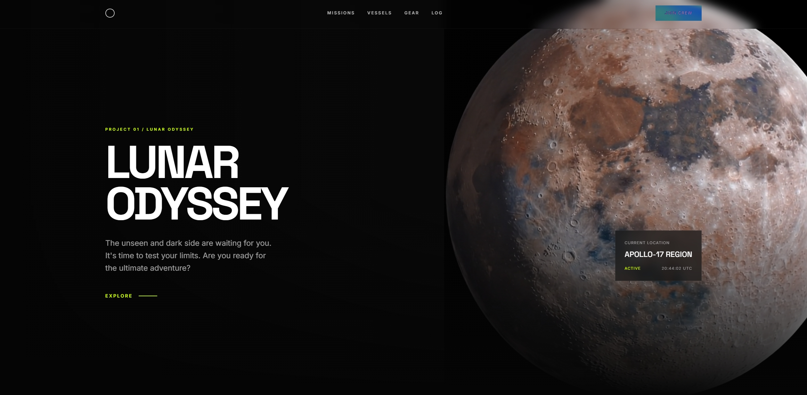

# Lunar Odyssey

[](https://github.com/OldNero/LUNAR-ODYSSEY/actions/workflows/deploy.yml)


<br/>
<p align="center">
  
</p>
<br/>

*The unseen and dark side are waiting for you. It's time to test your limits.*

**Lunar Odyssey** is an ultra-premium, dark-themed web experience designed to evoke the awe, scale, and mystery of deep space exploration. Built with performance and aesthetics in mind, the site leverages cutting-edge web technologies to deliver a cinematic user experience.

---

## 🌌 Design Philosophy

Our core design philosophy centers around **"Controlled Vastness."** 

Space is endlessly dark and terrifyingly vast, but human engineering brings precision, structure, and intense focus to the void. We reflect this by utilizing aggressive negative space (the void) sharply contrasted by ultra-precise, high-visibility neon accents (the engineering).

- **Immersion First:** The user should feel like they are interacting with a high-end terminal aboard a luxury orbital vessel.
- **Cinematic Pacing:** Information is revealed sequentially. We don't overwhelm the user; we let them explore.
- **Utilitarian Elegance:** Every border, line, and piece of data feels distinctly utilitarian, yet styled with the utmost luxury.

## 🎨 Design System

### Typography
We utilize a stark contrast in typographic choices to separate the "branding/display" elements from the "data/interface" elements.
- **Display Font:** `Space Grotesk` — Used for massive, commanding hero headers and critical numbers. Its geometric, brutalist structure mirrors aerospace engineering.
- **Interface Font:** `Inter` — Used for paragraphs, data labels, and UI elements. Uncompromisingly legible, even at micro-sizes.

### Color Palette
The color system relies on extreme contrast. We avoid muddy grays and lean into true blacks.
- **The Void (Background):** `#050505` — True, deep black.
- **The Vessel (Surfaces):** `#0a0a0a` to `#111111` — Barely perceptible elevation for cards, grids, and glass panels.
- **The Beacon (Accent):** `#ccff00` (Neon Yellow/Green) — A highly aggressive, high-visibility accent used strictly for interactive elements, status indicators, and critical data points.

### Animation & Motion
Motion is an integral part of the Lunar Odyssey experience, powered by GSAP.
- **Load Sequencer:** Elements don't just appear; they are initialized. Navigation drops down, backgrounds scale in, and text staggers up sequentially.
- **Scroll Triggers:** As the user descends into the page, data grids and objectives snap into existence using elastic "back" easings to mimic mechanical precision.
- **Parallax Layers:** Deep background elements (like the footer moon texture) scrub against the scroll position, creating a profound sense of depth.

---

## 🛠 Tech Stack

- **Vite:** Next-generation frontend tooling for instantaneous hot-module replacement and optimized builds.
- **Tailwind CSS v4:** A utility-first CSS engine powering the entire design system directly from the HTML structure.
- **GSAP & ScrollTrigger:** The industry standard for high-performance, complex timeline animations and scroll-based interactions.
- **Vanilla JavaScript:** Keeping the logic lightweight, fast, and dependency-free.

---

## 🚀 Getting Started

To run the Lunar Odyssey terminal locally:

### 1. Install Dependencies
```bash
npm install
```

### 2. Start the Development Server
```bash
npm run dev
```

### 3. Build for Production
```bash
npm run build
```

---
*System v2.4.0 — Secure Comms Enabled.*
